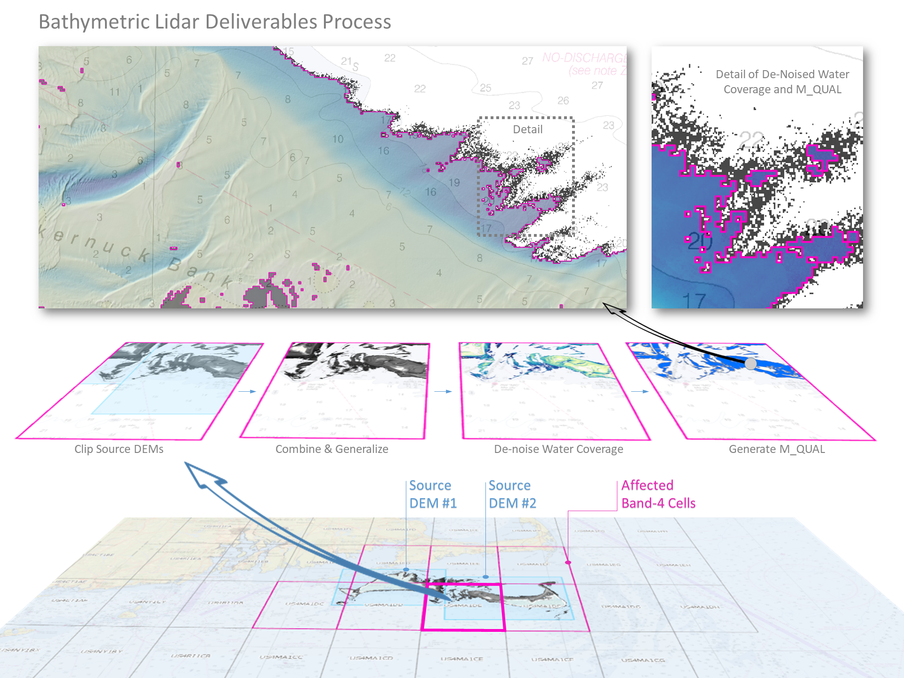

Workflow
========

Outlined in the figure below, the product cell workflow consists of ## main steps:

For each product cell:

1) clip each source DEM with cell geometry
2) merge clipped source DEMS to create cell source DEM
3) generalize cell source DEM to product resolution (typically 5-m)
4) extract water-only DEM from generalized DEM
5) generate M_QUAL from denoised water-only DEM
6) clip original generalized DEM with M_QUAL

